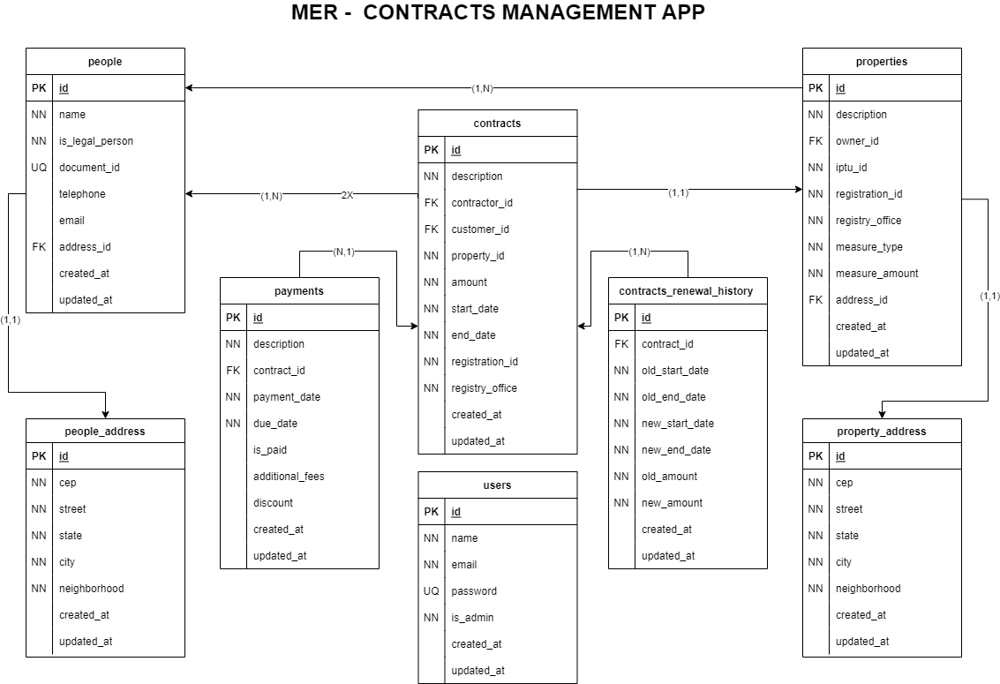

# Welcome to contracts-management-api 👋

[](http://localhost:3335/api/docs)
[](#)

> API to manager contracts

## ER Diagram


## App Requirements
* [all requirements here (pt-BR)](./docs/requirements.md)

## Techs

* [typescript](https://www.typescriptlang.org)
* [ExpressJS](http://expressjs.com)
* [Swagger](https://swagger.io/)
* [docker](https://www.docker.com)
* [docker-compose](https://docs.docker.com/compose/)
* [typeorm](https://typeorm.io/#/)
* [postgres](https://www.postgresql.org)
* [Eslint](https://eslint.org)
* [Prettier](https://prettier.io)
* [Jest](https://jestjs.io)
* [JWT](https://jwt.io)
* [commitizen](https://commitizen-tools.github.io/commitizen/)

## Install

```sh
yarn install
```

## Usage

```sh
docker-compose up -d
```

## Run tests

```sh
yarn test
```

## Deploy on production

**OBS: using docker compose**

### step by step
* setup `ormconfig.json` with database credentials and change *"entities"*, *"migration"* and *"cli"* properties to run on **dist** folder, and change ".ts" to ".js" on migrations dir
  - Example:
    ```json
        {
      "type": "postgres",
      "host": "database",
      "port": "5432",
      "username": "docker",
      "password": "contracts",
      "database": "contracts",
      "entities": ["./dist/modules/**/entities/*.js"],
      "migrations": ["./dist/shared/infra/typeorm/migrations/*"],
      "cli": {
        "migrationsDir": "./dist/shared/infra/typeorm/migrations"
      }
    }

    ```
* create and setup `.env` file like as `.env.example` file
* change the **target** property to **"production"** on service: "app" in `docker-compose.yml` file
* On root project, run:
  ```sh
  COMPOSE_DOCKER_CLI_BUILD=1 DOCKER_BUILDKIT=1 docker-compose build
  ```
* after:
  ```sh
  docker-compose up -d

  ```
* after the container is load and running, execute the `bash` into container
  ```sh
  docker exec -it contracts-management bash
  ```
* execute the prod script (migrations and admin seed)
  ```sh
  yarn prod:script
  ```


## Author

👤 **Danilo Souza**

* Github: [@DaniloSouza19](https://github.com/DaniloSouza19)
* LinkedIn: [@danilosouzati](https://linkedin.com/in/danilosouzati)

## Show your support

Give a ⭐️ if this project helped you!


***
_This README was generated with ❤️ by [readme-md-generator](https://github.com/kefranabg/readme-md-generator)_
